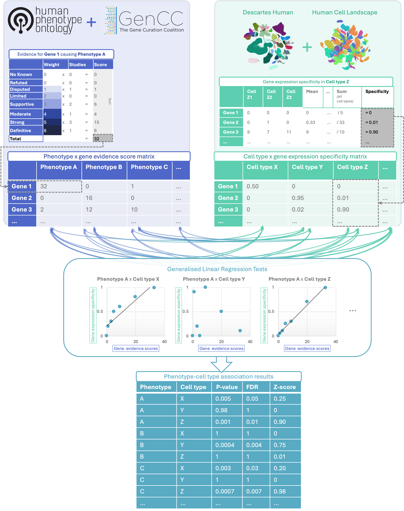

## Identification of cell types underlying thousands of rare diseases and subtraits

### Authors

Brian M. Schilder, Kitty B. Murphy, Bobby Gordon-Smith, Jai Chapman,
Momoko Otani, Nathan G. Skene

### Summary

Rare diseases (RDs) are an extremely heterogeneous and underserved
category of medical conditions. While the majority of RDs are strongly
genetic, it remains largely unknown via which physiological mechanisms
genetics cause RD. Therefore, we sought to systematically characterise
the cell type-specific mechanisms underlying all RD phenotypes with a
known genetic cause by leveraging the Human Phenotype Ontology and
transcriptomic single-cell atlases of the entire human body from
embryonic, foetal, and adult samples.

This repository contains the data and code needed to replicate the
analyses in our preprint [insert link to preprint], as well as links to
the R packages required (see below).

### Manuscript

To reproduce this entire study, we have provided [a quarto
document](https://github.com/neurogenomics/rare_disease_celltyping/blob/master/manuscript/index.qmd)
which programmatically recreates all analyses and plots. To use it,
follow these steps:

-   Clone this repository:
    `git clone https://github.com/neurogenomics/rare_disease_celltyping.git`

-   Install the [quarto Command Line
    Tool](https://quarto.org/docs/get-started/), and the [`quarto` R
    package](https://cran.r-project.org/web/packages/quarto/index.html).

-   Within the `manuscript` directory of the cloned repository, run
    `quarto render index.qmd` to generate the manuscript.

[A pre-rendered PDF version of the manuscript is available
here](https://github.com/neurogenomics/rare_disease_celltyping/blob/master/manuscript/_manuscript/index.pdf).

### Datasets / Results

All of the datasets used in this study can be imported using functions
within the `HPOExplorer` and `MSTExplorer` R packages. Additional
resources, such as phenotype-cell type enrichment results, can be found
on the *Releases* pages of `HPOExplorer` and `MSTExplorer`.

-   <https://github.com/neurogenomics/HPOExplorer/releases>

-   <https://github.com/neurogenomics/MSTExplorer/releases>

### Packages

-   [KGExplorer](https://github.com/neurogenomics/KGExplorer): Imports
    and analyses large-scale biomedical knowledge graphs and ontologies.

-   [HPOExplorer](https://github.com/neurogenomics/HPOExplorer):
    Contains extensive functions for easily importing, annotating,
    filtering, and visualising the Human Phenotype Ontology (HPO) at the
    disease, phenotype, and gene levels.

-   [MSTExplorer](https://github.com/neurogenomics/MSTExplorer):
    Systematically identifies, prioritises, and visualises
    cell-type-specific gene therapy targets across the phenome.
